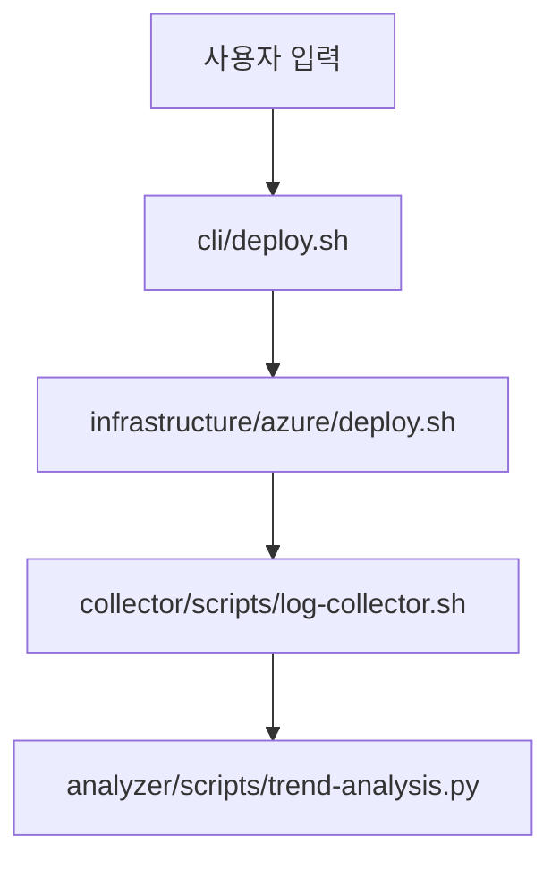

# draft/collector/analyzer 디렉토리 구조 도입 검토 보고서

## 검토 개요

Papertrail 방법론의 확장으로 **draft**, **collector**, **analyzer** 디렉토리 구조 도입 가능성을 검토했습니다. 이 구조는 기존 배포 자동화 중심의 모듈에서 데이터 수집·분석 워크플로우를 지원하는 계층을 추가하는 것을 목표로 합니다.

## 제안 구조

### 디렉토리 레이아웃
```
papertrail/
├── core/                     # 기존 순수 유틸리티
├── infrastructure/azure/     # 기존 Azure 연동
├── domain/                   # 기존 비즈니스 로직
├── cli/                     # 기존 실행 진입점
├── draft/                    # 새: 설계 초안 및 프로토타입
│   ├── architecture/         # 아키텍처 다이어그램, 의사결정 기록
│   ├── prototypes/           # 빠른 테스트용 스크립트
│   ├── meetings/             # 회의록
│   └── ideas.md              # 아이디어 브레인스토밍
├── collector/                # 새: 데이터 수집 모듈
│   ├── scripts/              # 수집 스크립트 (Bash, Python)
│   ├── config/               # 수집 설정 파일
│   ├── utils/                # 수집 유틸리티
│   └── adapters/             # 소스별 어댑터 (Azure, AWS, 로컬)
└── analyzer/                 # 새: 데이터 분석 및 보고
    ├── scripts/              # 분석 스크립트 (Python, R)
    ├── reports/              # 생성된 보고서 (HTML, PDF)
    ├── models/               # 분석/ML 모델
    └── visualizations/       # 시각화 스크립트 (Plotly, D3)
```

### 각 디렉토리의 목적

| 디렉토리 | 주요 책임 | 예시 콘텐츠 |
|----------|-----------|--------------|
| **draft** | 설계 초기 단계의 문서와 프로토타입 보관 | 아키텍처 스케치, 회의록, 아이디어 문서, 임시 스크립트 |
| **collector** | 외부 시스템으로부터 데이터 수집 | 로그 수집기, API 폴링 스크립트, 파일 모니터링, 데이터베이스 덤프 |
| **analyzer** | 수집된 데이터의 분석 및 인사이트 생성 | 통계 분석, 머신러닝 파이프라인, 보고서 생성, 대시보드 시각화 |

## 기존 Papertrail 구조와의 통합

### 의존성 방향
1. **collector**는 `infrastructure/azure/`의 유틸리티를 사용하여 Azure 리소스에 접근할 수 있습니다.
2. **analyzer**는 `domain/`의 비즈니스 규칙을 참조하여 도메인 특화 분석을 수행할 수 있습니다.
3. **draft**는 어떤 실행 모듈에도 의존하지 않으며, 문서와 프로토타입만 포함합니다.
4. **collector**와 **analyzer**는 `core/`의 순수 유틸리티를 자유롭게 이용할 수 있습니다.

### 계층적 관계
```
core → infrastructure → domain → cli
      ↘               ↗
      collector → analyzer
```
- collector는 infrastructure 수준의 연동을 필요로 합니다.
- analyzer는 collector가 제공한 데이터와 domain의 비즈니스 로직을 결합합니다.

## 예시 파일

### draft/architecture/deployment‑flow.mmd


### collector/scripts/log‑collector.sh
```bash
#!/usr/bin/env bash
# Azure Monitor 로그 수집
source ../../common-lib/infrastructure/azure/logging.sh

LOG_CATEGORY="containerapp"
START_TIME=$(date -u +"%Y-%m-%dT%H:%M:%S")
write_json_log "collector" "info" "로그 수집 시작" "category=$LOG_CATEGORY"

az monitor log-analytics query \
  --workspace "$LOG_ANALYTICS_WORKSPACE" \
  --analytics-query "ContainerAppConsoleLogs | where TimeGenerated > ago(1h)" \
  --output json > collected/logs.json
```

### analyzer/scripts/trend‑analysis.py
```python
#!/usr/bin/env python3
"""
배포 실패 추이 분석
입력: collector가 수집한 로그 JSON
출력: reports/deployment‑success‑rate.html
"""
import pandas as pd
import plotly.express as px

def load_logs(path):
    df = pd.read_json(path)
    df['success'] = df['status'] == 'Succeeded'
    return df

def generate_report(df):
    fig = px.line(df, x='timestamp', y='success', title='배포 성공률 추이')
    fig.write_html('../reports/deployment‑success‑rate.html')
```

## 변경 영향 분석

### 긍정적 영향
- **워크플로우 확장**: 배포 자동화 외에 데이터 수집·분석 파이프라인을 공식적으로 지원.
- **문서화 향상**: draft 디렉토리를 통해 설계 과정이 체계적으로 기록됨.
- **모듈 재사용**: collector/analyzer 모듈은 다른 프로젝트에서도 독립적으로 사용 가능.

### 부정적 영향
- **복잡도 증가**: 디렉토리 구조가 다소 복잡해질 수 있음.
- **학습 곡선**: 새로운 팀원에게 추가 계층을 설명해야 함.
- **마이그레이션 부담**: 기존 수집/분석 스크립트를 새 구조로 이동해야 함 (선택사항).

### 마이그레이션 경로
1. **점진적 도입**: 기존 스크립트를 그대로 유지한 채 새 디렉토리에만 추가.
2. **매핑 확장**: `migrate.sh`에 collector/analyzer/draft에 대한 매핑 규칙 추가.
3. **CI/CD 영향 없음**: 새 디렉토리는 기존 배포 파이프라인에 영향을 주지 않음.

## 권장사항

### 도입 시나리오 A (점진적)
1. `papertrail/` 루트에 `draft/`, `collector/`, `analyzer/` 디렉토리 생성.
2. 각 디렉토리에 README.md와 예시 파일 배치.
3. 기존 프로젝트에서 관련 스크립트를 점진적으로 이동.

### 도입 시나리오 B (참조만)
1. 구조를 문서로만 정의하고 실제 디렉토리는 생성하지 않음.
2. 향후 필요 시 구현.

### 권장 선택: **시나리오 A (점진적)**
- 실제 디렉토리를 만들고 예시 파일을 제공하면 팀이 새로운 구조에 익숙해지는 데 도움이 됩니다.
- 기존 배포 스크립트와의 통합 테스트를 통해 실용성을 검증할 수 있습니다.

## 결론

draft/collector/analyzer 디렉토리 구조는 Papertrail 방법론을 데이터 수집·분석 영역으로 자연스럽게 확장합니다. 기존 모듈과의 의존성이 명확하며, 점진적 도입이 가능합니다. **도입을 권장**하며, 다음 단계로 세부 구현 계획을 수립할 수 있습니다.

---

*이 보고서는 2026‑04‑18에 작성된 검토 결과입니다. 실제 도입 전 팀 내 검토 및 피드백을 거치는 것이 좋습니다.*